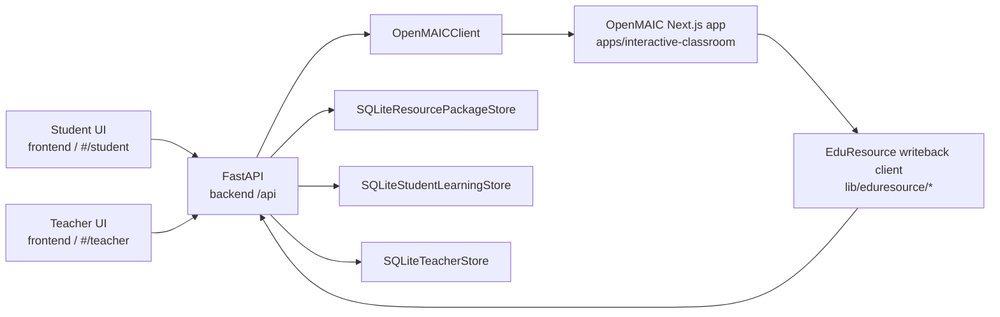

# OpenMAIC Module Boundaries

This document is the local ownership map for the THU-MAIC/OpenMAIC integration.
Keep it updated before moving code across module boundaries.

## One-Line Rule

OpenMAIC is the interactive classroom runtime. EduResource-Agent is the student,
teacher, profile, resource package, and evaluation system of record.

Do not split OpenMAIC into the existing React frontend, and do not let OpenMAIC
replace EduResource storage.

## Module Ownership

| Module | Path | Owns | Must not own |
| --- | --- | --- | --- |
| Student frontend | `frontend/src/App.tsx`, `frontend/src/components/*` | Student workflow, knowledge selection, classroom launcher, lightweight resource cards, dashboard display | OpenMAIC scene rendering internals or OpenMAIC generation logic |
| Teacher frontend | `frontend/src/components/TeacherPortal/*` | Class evidence, teacher generation request, review queue, approve/deploy surface | OpenMAIC editor/playback internals |
| FastAPI orchestration | `backend/app/api/routes.py` | EduResource API contract, classroom job creation, resource-package persistence, OpenMAIC polling, import endpoints | Next.js routes or OpenMAIC internal state |
| Student learning store | `backend/app/services/student_learning_store.py` | Student profile, learning path, classroom job state, evaluation writeback application | OpenMAIC stage/scene generation |
| Resource package store | `backend/app/services/resource_package_store.py` | ResourcePackage, ResourceItem, ExerciseSet, ExerciseAttempt, EvaluationRecord | Teacher review workflow or OpenMAIC runtime files |
| OpenMAIC client | `backend/app/services/openmaic_client.py` | Calls OpenMAIC `generate-classroom` endpoints from FastAPI | Mapping scenes into EduResource models |
| OpenMAIC import | `backend/app/services/openmaic_import.py` | Maps OpenMAIC Stage/Scene output into EduResource ResourcePackage/ExerciseSet | Starting or polling OpenMAIC jobs |
| OpenMAIC attempts import | `backend/app/services/openmaic_attempts.py` | Validates and persists quiz answers, builds EvaluationRecord | Student UI state or OpenMAIC playback UI |
| OpenMAIC subsystem | `apps/interactive-classroom/` | Next.js classroom generation, playback, quiz UI, interactive simulations, PBL, PPT/HTML export | EduResource database ownership or core FastAPI schemas |
| Supplemental resources | `backend/app/services/supplemental_resources.py`, `frontend/src/utils/learningResources.ts` | Bilibili search links, local algorithm animation links, static reading/search entrypoints | OpenMAIC classroom generation or quiz writeback |
| Algorithm viz studio | `html/viz-studio.html`, `html/viz/*` | Teacher/student local algorithm demonstrations | OpenMAIC classroom runtime |

## Runtime Topology

## Student Classroom Flow

1. Student chooses a knowledge point in the EduResource student UI.
2. The frontend calls `POST /api/students/{student_id}/interactive-classrooms`.
3. FastAPI creates an in-progress `ResourcePackage`, records a learning-path step,
   builds `eduResourceContext`, and calls OpenMAIC through `OpenMAICClient`.
4. The frontend polls
   `GET /api/students/{student_id}/interactive-classrooms/{job_id}`.
5. OpenMAIC generates and serves the classroom URL.
6. OpenMAIC maps Stage/Scene output through `apps/interactive-classroom/lib/eduresource/*`
   and posts it back to FastAPI.
7. FastAPI imports scenes as `ResourceItem`s and quiz questions as an `ExerciseSet`.
8. When a student answers quiz questions, OpenMAIC posts attempts back to FastAPI.
9. FastAPI writes `ExerciseAttempt` and `EvaluationRecord`, then updates the student
   dashboard/profile/path through `SQLiteStudentLearningStore`.

## API Contracts

EduResource to OpenMAIC:

- `POST {OPENMAIC_BASE_URL}/api/generate-classroom`
- `GET  {OPENMAIC_BASE_URL}/api/generate-classroom/{job_id}`

OpenMAIC to EduResource:

- `POST /api/integrations/openmaic/resource-package`
- `POST /api/integrations/openmaic/exercise-attempts`

EduResource read APIs:

- `GET /api/students/{student_id}/dashboard`
- `GET /api/resource-packages/{package_id}`
- `GET /api/resource-packages/{package_id}/attempts?student_id=...`

## Data Boundary

OpenMAIC may produce:

- stage/classroom id
- scene list
- slides/visual scene content
- quiz scene questions
- interactive HTML simulation/PBL scene metadata
- classroom playback URL
- submitted quiz answers

EduResource must own:

- student id and profile
- target knowledge id/name
- learning path step
- resource package id
- resource item records
- exercise set and attempts
- evaluation record
- teacher review queue

## Where Recent Resource Work Fits

The Bilibili/search/local-animation resources are not OpenMAIC. They are
supplemental resources attached to generated EduResource packages and teacher
review cards.

Use them for lightweight resource enrichment. Use OpenMAIC only when the product
needs an actual interactive classroom with generated scenes, quiz playback,
simulation, PBL, or export.

## Safe Change Checklist

Before changing OpenMAIC integration:

- Keep all OpenMAIC-derived code inside `apps/interactive-classroom/`.
- Add only adapter code under `apps/interactive-classroom/lib/eduresource/`
  when OpenMAIC needs to call EduResource.
- Add only client/import/store code under `backend/app/services/` when FastAPI
  needs to call or ingest OpenMAIC.
- Persist through `SQLiteResourcePackageStore` and `SQLiteStudentLearningStore`.
- Verify the full loop: create classroom, poll job, import package, submit quiz
  attempts, update dashboard.
- Treat `502/503` after FastAPI successfully calls OpenMAIC as OpenMAIC runtime
  or provider configuration unless tests show the EduResource contract broke.
