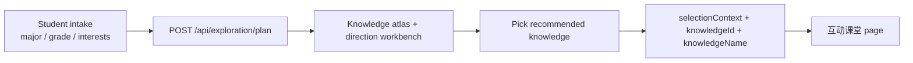
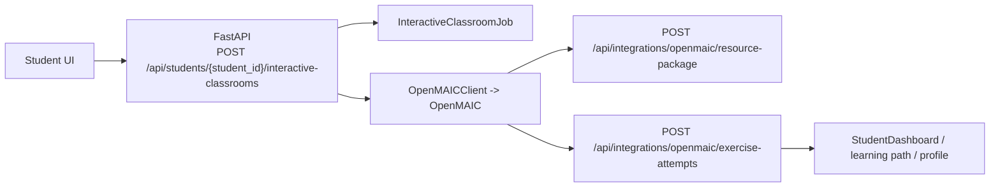

# Student Frontend Workspace

This document describes the cleaned-up student-side frontend after the
professional-exploration and interactive-classroom restructuring.

## Goal

Keep the student UI focused on two main journeys only:

1. `专业探索` decides direction, evidence, and recommended knowledge.
2. `互动课堂` turns the chosen knowledge into an OpenMAIC classroom and shows
   the writeback chain clearly.

Do not mix digital-human controls, coach workbench, exploration maps, light
resource cards, and classroom runtime status in one flat page again.

## Page Composition

### Shell

- `frontend/src/App.tsx`
  - Owns global student-side state:
    - current `studentId`
    - selected `knowledgeId` / `knowledgeName`
    - `selectionContext`
    - `InteractiveClassroomJob`
    - `StudentDashboard`
    - light-resource `taskId` / `results`
  - Owns polling for:
    - `GET /api/students/{student_id}/interactive-classrooms/{job_id}`
    - `GET /api/tasks/{task_id}/results`
  - Renders a two-column shell:
    - left: student context rail
    - right: main stage with the active journey

### Professional Exploration

- `frontend/src/components/MajorExplorationPanel/index.tsx`
  - Owns exploration request/workspace state and backend mutations.
  - Coordinates the exploration page sections instead of rendering one giant
    all-in-one component.

- `frontend/src/components/MajorExplorationPanel/model.ts`
  - Owns frontend-only view models for exploration:
    - `LEVEL_OPTIONS`
    - `PROFILE_LABELS`
    - `buildExplorationMetrics(...)`
    - `buildKnowledgeAtlas(...)`
  - Converts raw `ExplorationPlan` / `ExplorationWorkspace` data into display
    structures used by the map and overview cards.

- `frontend/src/components/MajorExplorationPanel/KnowledgeAtlas.tsx`
  - Replaces the old decorative “adventure map” style with a data-first
    knowledge atlas.
  - Organizes the exploration map into four lanes:
    - foundation
    - core
    - direction
    - practice/evidence

- `frontend/src/components/MajorExplorationPanel/MatchWorkbench.tsx`
  - Contains the direction-match analysis and the candidate-direction list.

- `frontend/src/components/MajorExplorationPanel/WorkspaceSection.tsx`
  - Contains task execution, resource evidence, profile updates, reviews, and
    growth reports.

### Interactive Classroom

- `frontend/src/components/student-workspace/InteractiveClassroomStudio.tsx`
  - Owns the classroom-side page composition:
    - manual knowledge entry
    - classroom launch controls
    - FastAPI/OpenMAIC/writeback chain
    - runtime job status
    - light resource pack
    - agent trace panel

- `frontend/src/components/student-workspace/StudentContextRail.tsx`
  - Keeps student context stable across both journeys:
    - student id
    - active knowledge focus
    - next suggestions
    - mastery snapshot
    - latest classroom feedback

- `frontend/src/components/student-workspace/model.ts`
  - Defines student-side runtime data structures:
    - `GenerateSelectionContext`
    - `InteractiveClassroomJob`
    - `StudentDashboard`
    - `buildClassroomFlow(...)`

## Exploration Data Flow

Key rule:

- The exploration page does not generate classrooms directly.
- It produces a clear handoff object:
  - `knowledge_id`
  - `knowledge_name`
  - `selectionContext.reason`
  - `selectionContext.suggested_difficulty`

## Interactive Classroom Chain

In the frontend, the classroom page must explain these stages explicitly:

1. Student picks or edits a knowledge point.
2. Student UI calls FastAPI to create a classroom job.
3. FastAPI delegates generation to OpenMAIC.
4. OpenMAIC writes classroom/package structure back into EduResource.
5. Quiz attempts write back again and update mastery / next focus.

## Styling Rule

- `frontend/src/components/MajorExplorationPanel/major-exploration.css`
  owns exploration-specific layout.
- `frontend/src/components/student-workspace/student-workspace.css`
  owns the student shell and classroom journey layout.

Do not re-expand `frontend/src/freddie-theme.css` into a page-level junk drawer.
Use it for shared theme tokens and legacy compatibility only.

## Regression Guard

When changing the student-side frontend again, preserve these invariants:

- `App.tsx` stays a shell, not a mega-page.
- Professional exploration stays split into view-model + sections.
- The exploration map remains data-driven, not a static background gimmick.
- Interactive classroom stays separated from exploration UI.
- The OpenMAIC handoff chain stays visible in the student UI, not buried in
  docs only.
