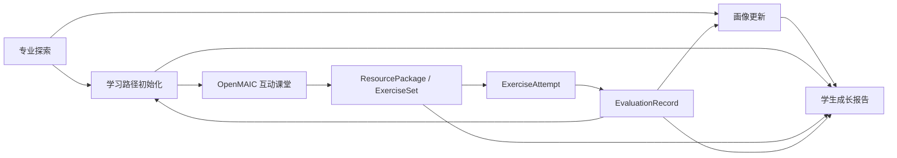

# Student Business API Implementation Plan

## 目标

补齐学生端真实业务闭环中缺失的四类能力：

1. 学生画像 API
2. 专业探索结果落库
3. 学习路径 Step 更新
4. 学习报告生成与读取

本计划不另起一套 `/api/student/*` 平行系统，而是在当前已经存在的 `/api/students/{student_id}/*` 主线上补齐接口。

当前主线保持不变：



## 设计原则

- EduResource-Agent 继续作为学生画像、路径、资源包、评估、报告的 system of record。
- OpenMAIC 只负责互动课堂 runtime，不接管 EduResource 数据存储。
- 优先复用现有 `SQLiteStudentLearningStore` 和 `SQLiteResourcePackageStore`。
- 新增能力通过轻量 adapter/service 完成，不重写现有 `routes.py` 大文件。
- 前端页面必须读取真实 API，不能只读前端 state。
- 专业探索结果必须进入画像和学习路径，不能只是展示页。

## 当前已存在基础

### 已存在 Store

- `backend/app/services/student_learning_store.py`
  - `StudentProfile`
  - `StudentProfileHistory`
  - `LearningPath`
  - `LearningPathStep`
  - `InteractiveClassroomJob`
  - evaluation 后更新 profile/path

- `backend/app/services/resource_package_store.py`
  - `ResourcePackage`
  - `ExerciseSet`
  - `ExerciseAttempt`
  - `EvaluationRecord`

### 已新增业务补充层

- `backend/app/services/student_business.py`

该文件用于承接四块补齐能力：

- `list_profile_history(...)`
- `patch_student_profile(...)`
- `persist_exploration_plan(...)`
- `update_learning_path_step(...)`
- `build_and_save_student_report(...)`
- `SQLiteStudentBusinessStore`

其中 `SQLiteStudentBusinessStore` 负责保存：

- `ExplorationSession`
- `Report`

## 第一阶段：后端 API 接线

### 1. 学生画像 API

#### GET `/api/students/{student_id}/profile`

用途：读取学生画像。

逻辑：

```text
learning_store.get_profile(student_id)
如果不存在：learning_store.default_profile(student_id)
```

返回：`StudentProfile`

#### PATCH `/api/students/{student_id}/profile`

用途：手动修改学生画像。

请求体：复用 `StudentProfilePatchRequest`

逻辑：

```text
patch_student_profile(...)
写入 student_profiles
写入 profile_history
```

返回：更新后的 `StudentProfile`

#### GET `/api/students/{student_id}/profile/history`

用途：查看画像更新历史。

逻辑：

```text
list_profile_history(learning_store, student_id)
```

返回：`list[StudentProfileHistory]`

### 2. 专业探索落库 API

#### POST `/api/students/{student_id}/exploration-sessions`

用途：学生端专业探索真实落库，并进入后续学习路径。

请求体：复用 `ExplorationRequest`。

内部流程：

```text
1. 修正 payload.student_id = path 中的 student_id
2. 调用现有 major exploration service 生成 ExplorationPlan
3. 调用 persist_exploration_plan(...)
4. 写入 StudentProfile
5. 写入 StudentProfileHistory
6. 写入 LearningPath / LearningPathStep
7. 写入 ExplorationSession
```

返回：`ExplorationSession`

#### GET `/api/students/{student_id}/exploration-sessions/{session_id}`

用途：读取已落库的探索会话。

逻辑：

```text
business_store.get_exploration_session(student_id, session_id)
```

返回：`ExplorationSession`

### 3. 学习路径 API

#### GET `/api/students/{student_id}/learning-path`

用途：读取当前学生学习路径。

逻辑：

```text
learning_store.get_or_create_learning_path(student_id)
```

返回：`LearningPath`

#### PATCH `/api/students/{student_id}/learning-path/steps/{step_id}`

用途：学生端或课堂回写后更新学习路径步骤。

请求体建议字段：

```json
{
  "status": "pending | in_progress | done | adjusted",
  "package_id": "pkg_xxx",
  "evaluation_id": "eval_xxx",
  "evidence": "本次课堂表现说明",
  "mastery_after": 82,
  "updated_reason": "根据课堂测验正确率更新"
}
```

逻辑：

```text
update_learning_path_step(...)
写回 learning_paths
追加 adjustment_history
```

返回：更新后的 `LearningPath`

### 4. 学习报告 API

#### POST `/api/students/{student_id}/reports`

用途：基于真实数据生成学生成长报告。

请求体：`ReportCreateRequest`

逻辑：

```text
build_and_save_student_report(...)
读取 profile
读取 learning path
读取 resource packages
读取 evaluation records
生成 markdown
保存 report
```

返回：`Report`

#### GET `/api/students/{student_id}/reports/{report_id}`

用途：读取已生成报告。

逻辑：

```text
business_store.get_report(student_id, report_id)
```

返回：`Report`

## 第二阶段：Routes 接入方式

不建议继续扩大 `backend/app/api/routes.py` 体积。

建议新增：

```text
backend/app/api/student_business.py
```

提供：

```python
build_student_business_router(ctx)
```

然后在 `backend/app/api/__init__.py` 或 `backend/main.py` 中 include：

```python
app.include_router(build_student_business_router(ctx))
```

如果当前项目更适合统一从 `app.api.__init__` 暴露，则改为：

```python
from .student_business import build_student_business_router
```

并保持原有 `build_router(ctx)` 不变。

## 第三阶段：前端接线

当前学生端已经分为：

- `画像与广度`
- `培养方案`
- `课堂验证`
- `回写证据`

前端不需要大改 UI，主要补数据源。

### 1. 画像与广度

需要接：

```text
GET /api/students/{student_id}/profile
PATCH /api/students/{student_id}/profile
GET /api/students/{student_id}/profile/history
```

页面要展示：

- 专业背景
- 知识掌握度
- 学习目标
- 学习风格
- 易错点
- 资源偏好
- 学习节奏
- 当前进度
- 画像历史

### 2. 专业探索页

当前旧探索接口仍可保留，但学生端业务闭环优先调用：

```text
POST /api/students/{student_id}/exploration-sessions
```

成功后刷新：

```text
GET /api/students/{student_id}/dashboard
GET /api/students/{student_id}/learning-path
```

### 3. 培养方案 / 学习路径页

需要接：

```text
GET /api/students/{student_id}/learning-path
PATCH /api/students/{student_id}/learning-path/steps/{step_id}
```

### 4. 回写证据 / 报告页

需要接：

```text
POST /api/students/{student_id}/reports
GET /api/students/{student_id}/reports/{report_id}
```

报告生成后展示 markdown，并允许后续下载或复制。

## 第四阶段：端到端验收链路

至少跑通一个学生：`stu_001`

### 验收脚本流程

```bash
# 1. 生成专业探索并落库
curl -X POST http://localhost:8000/api/students/stu_001/exploration-sessions \
  -H 'Content-Type: application/json' \
  -d '{
    "major": "计算机科学与技术",
    "grade": "大一",
    "education_level": "本科",
    "foundation_level": "beginner",
    "interests": ["AI 应用", "Web 开发"],
    "weekly_hours": 6
  }'

# 2. 查看画像
curl http://localhost:8000/api/students/stu_001/profile

# 3. 查看画像历史
curl http://localhost:8000/api/students/stu_001/profile/history

# 4. 查看学习路径
curl http://localhost:8000/api/students/stu_001/learning-path

# 5. 生成互动课堂
curl -X POST http://localhost:8000/api/students/stu_001/interactive-classrooms \
  -H 'Content-Type: application/json' \
  -d '{
    "target_knowledge_id": "linked-list-basics",
    "target_knowledge_name": "链表基础",
    "difficulty": 2
  }'

# 6. OpenMAIC 回写 package / attempts 后，查看 dashboard
curl http://localhost:8000/api/students/stu_001/dashboard

# 7. 生成学习报告
curl -X POST http://localhost:8000/api/students/stu_001/reports \
  -H 'Content-Type: application/json' \
  -d '{"report_type": "student_growth"}'
```

## 第五阶段：测试清单

### 后端单测建议

新增测试文件：

```text
tests/test_student_business_api.py
```

覆盖：

1. `PATCH profile` 后 profile_history 增加记录。
2. `POST exploration-sessions` 后：
   - 返回 ExplorationSession
   - profile 被创建或更新
   - learning path 被创建或追加 step
3. `PATCH learning-path step` 后：
   - step 状态变化
   - adjustment_history 增加记录
4. `POST reports` 后：
   - report 被保存
   - GET report 可读取
   - markdown 包含画像、路径、资源、评估模块

### 手动验收标准

- 专业探索结果能落库。
- 画像能查看、修改、追踪历史。
- 资源包仍走现有 OpenMAIC 主线。
- 练习评估仍更新画像和路径。
- 学习路径 step 可被手动或评估回写更新。
- 报告基于真实 store 数据生成，而不是前端拼假数据。

## 实施顺序

### Step 1：后端补 Router

新增：

```text
backend/app/api/student_business.py
```

接入：

```text
GET profile
PATCH profile
GET profile/history
POST exploration-sessions
GET exploration-sessions/{id}
GET learning-path
PATCH learning-path/steps/{id}
POST reports
GET reports/{id}
```

### Step 2：接入 app 生命周期

在 FastAPI lifespan 中 include 新 router。

### Step 3：前端替换调用

将学生端专业探索提交入口改为：

```text
POST /api/students/{student_id}/exploration-sessions
```

将培养方案、路径、报告页面改为读新接口。

### Step 4：补测试 / 手动 curl 验证

先用 curl 跑完整链路，再考虑前端联调。

## 风险点

1. `routes.py` 当前已经很大，不建议继续堆逻辑。
2. 专业探索旧接口和新学生探索落库接口需要共存。
3. `Report` schema 已存在，但报告 store 在新增 `SQLiteStudentBusinessStore` 中，后续如要统一 DB，可以再迁移。
4. OpenMAIC 本地服务不可用时，互动课堂链路可能返回 502/503，这不代表 EduResource 存储层失败。
5. 前端如果仍旧调用旧 `/api/exploration/plan`，只能得到展示计划，不能满足“探索落库”验收。

## 最终验收

完成后，学生端应能跑通：

```text
专业探索
→ 写入画像
→ 写入学习路径
→ 选择知识点
→ 生成互动课堂 / 资源包
→ 完成练习
→ 生成评估
→ 更新画像
→ 更新学习路径
→ 生成成长报告
```

且所有关键对象都真实落库：

- StudentProfile
- StudentProfileHistory
- ExplorationSession
- ExplorationDirection
- LearningPath
- LearningPathStep
- ResourcePackage
- ExerciseSet
- ExerciseAttempt
- EvaluationRecord
- Report
